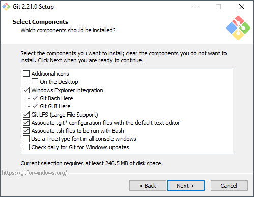
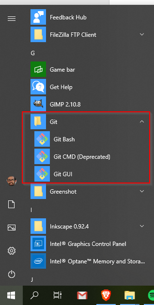
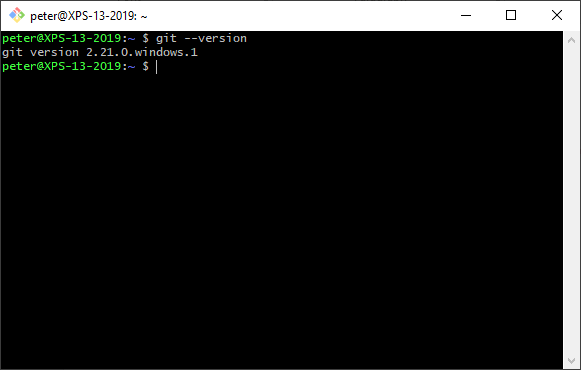

# Installing Git on Windows

## Installer
Download [Git for Windows](https://gitforwindows.org/) and run the installer:



You will see several prompts to configure Git for Windows. If you don't know what to choose, just click Next without changing anything. The defaults are sensible and usually what you want.

## Chocolatey

If you prefer Chocolatey, you can run:

```
choco install git
```

## Verify

You should now see a Git folder in your Start menu:



If you run Git Bash and enter `git --version`, you should see an output like this:


