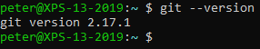

# Installing Git on Linux

## Installer

If you're running a Debian-based Linux distribution, run this command at the terminal:

```
sudo apt install git-all
```

If your Linux distribution is RPM-based, run this command:

```
sudo dnf install git-all
```

## Verify

After installing Git, run this command to check if it installed correctly:

```
git --version
```

You should see something like this:
 

