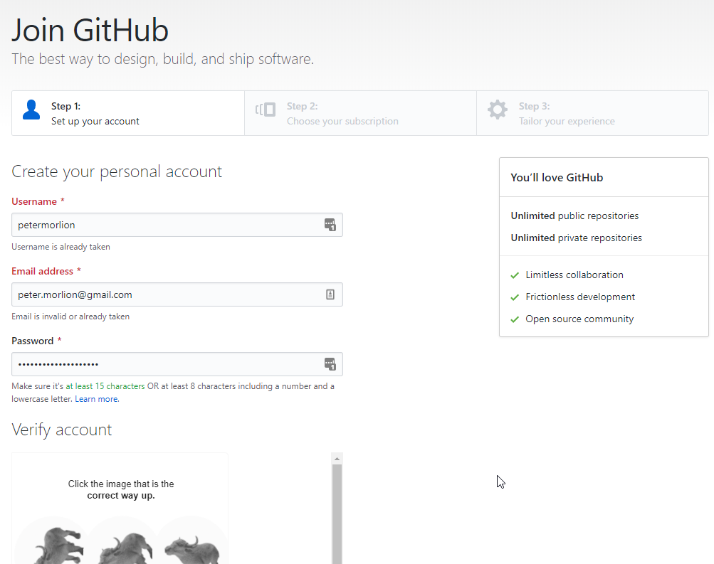
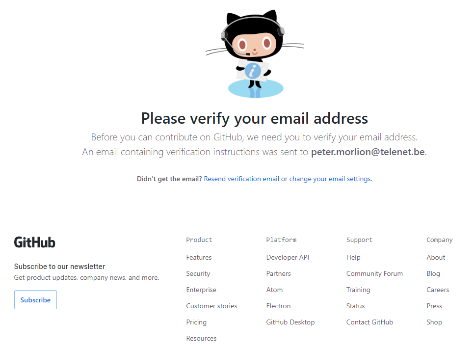

# Registering at GitHub

Go to [https://github.com](https://github.com) and follow the steps to create an account:

After you've completed the steps, you will have to verify your email address:

Check your email and click the link. You can now start using GitHub:

