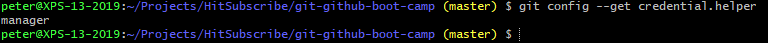

# Setting Up HTTPS

There is not much to set up if you use HTTPS.
But for convencience, you can use a credential helper.
This way, you will have to enter your credentials less 
frequently.

## Windows

If you've installed Git using the Git for Windows installer,
you will already have a credential helper set up.
You can verify this by running `git config --get credential.helper`:

If it isn't present, [download the latest installer from GitHub](https://github.com/Microsoft/Git-Credential-Manager-for-Windows). Then set the credential helper:

`git config --global credential.helper manager`

## Mac

Check if you have OS X Keychain Helper installed by running:

`git credential-osxkeychain`

If itsn't installed, a dialog will appear.

You can also install it  with Homebrew:

`brew install git`

Now tell Git to use it as credential helper:

`git config --global credential.helper osxkeychain`

## Linux

Set the credential helper:

`git config --global credential.helper cache`

This wil cache your password for 15 minutes. To change the timeout, use this command:

`git config --global credential.helper 'cache --timeout=3600'`

This example will set the timeout to 1 hour.
