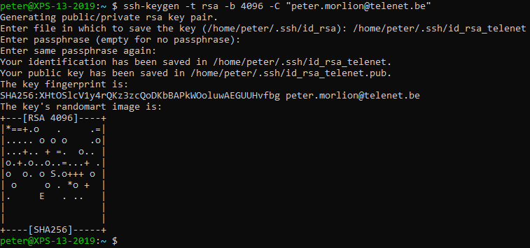
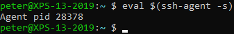
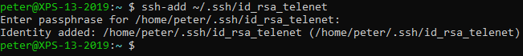
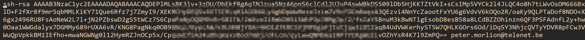
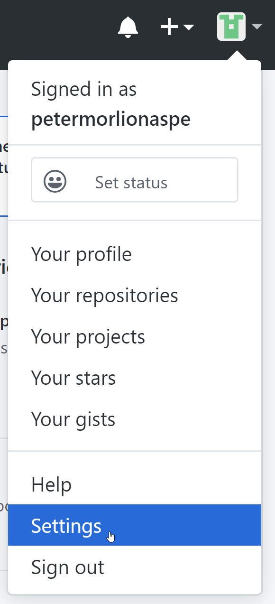
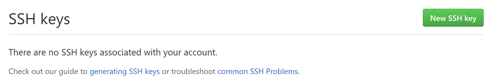
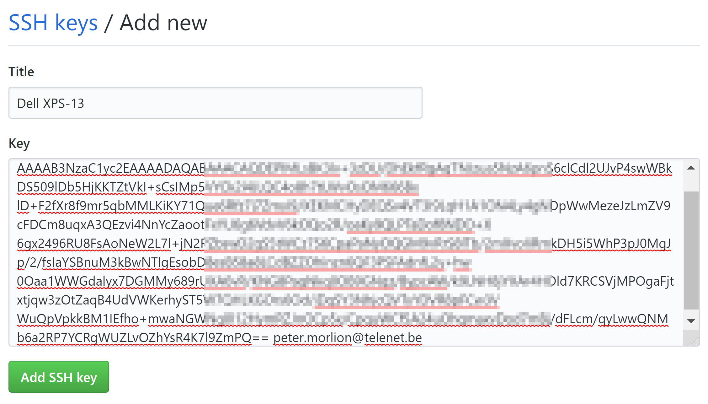
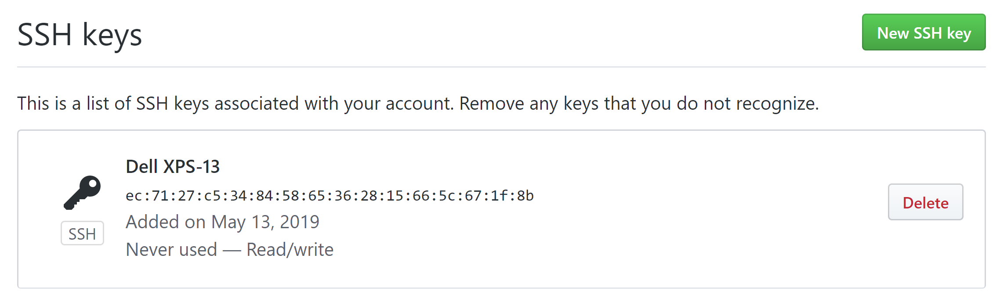

# Setting Up SSH

This is no longer the recommended approach by GitHub. Only execute
these steps if you prefer SSH.

## Generate an SSH key

Generate a new public/private key pair:



_(change the email address to yours)_

You will have to:

- enter a file location (you can use the default if you haven't already generated a key in the past)
- enter a password
- confirm the password

A password isn't actually required, but it's recommended.

## Add the key to ssh-agent

Check if ssh-agent is running. Start it if it isn't:



Add your key to the agent:



### Important for Mac OS X

Mac users should use the following command to add the key:

```
ssh-add -K ~/.ssh/id_rsa
```

If you are running OS X Sierra 10.12.2 or later, modify `~/.ssh/config` to include:

```
Host *
  AddKeysToAgent yes
  UseKeychain yes
  IdentityFile ~/.ssh/id_rsa
```

## Add Public Key to GitHub

Copy the contents of your **public** key to the clipboard. You can open the file with a text editor.

Make sure it's the public key (a file that ends in `.pub`). Its contents should look like this:



Notice how it starts with `ssh-rsa` and ends with the email address provided when generating the key.

Now go to GitHub and open the settings:



On the left, choose "SSH and GPG keys":


Click on the green "New SSH key" button:



Give the key a descriptive name and paste the contents of the public key:



Make sure you copy the entire contents of the public key file, including any newlines. Don't remove or add anything.

Click the green "Add SSH key" button and you should see the key added:


