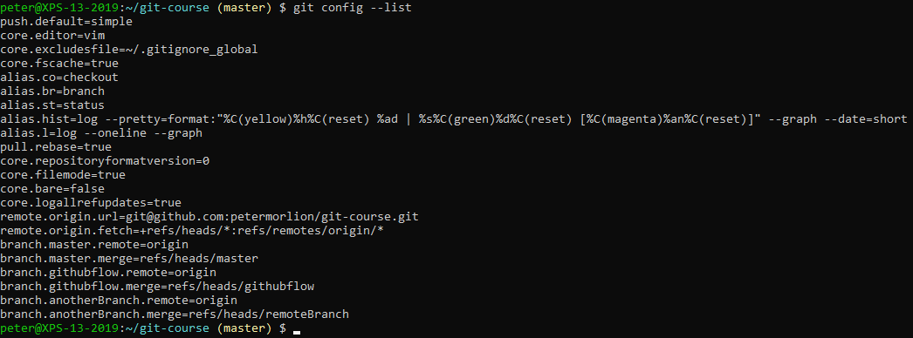
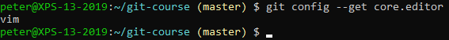
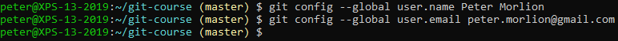

# Config

Check your current config first (your config may vary):

You can also get a specific configuration value:

Let's set our username and email:

You could potentially also set it for just this repository 
by omitting the `--global` flag.
