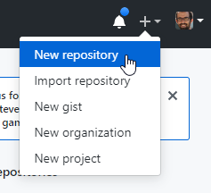
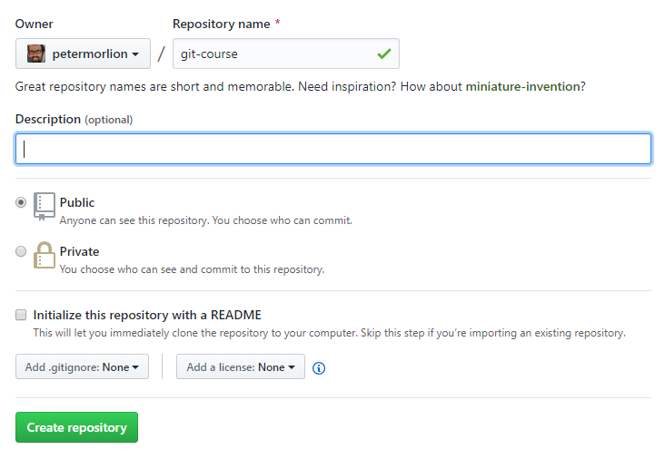
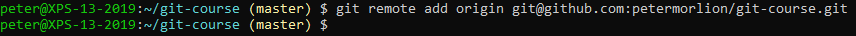
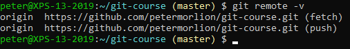

# Adding a Remote

First, create a new repository in GitHub. In the top right, click on the "+" icon and choose to create a new repository:

 
Give the repository a name and optionally a description:

 
The next screen will tell you how to import an existing repository, which is what we have locally.

First, add a remote:

To verify, you can list your remotes:
 

