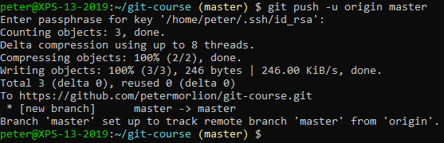

# Pushing to a Remote

Now, push your local repository to this remote:

 
Notice how Git tells us that our local master branch is set up to track the remote master branch. This means that any subsequent pushes no longer need the `-u origin master` part. Just a `git push` will be enough.
