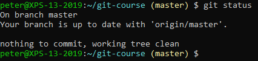
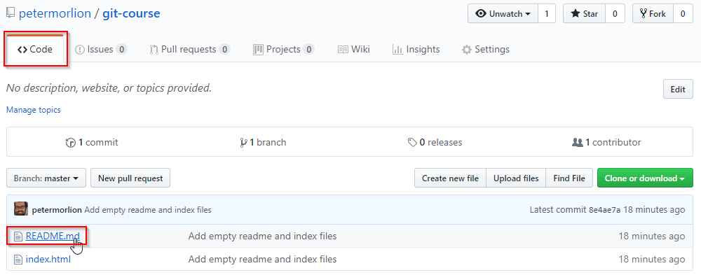
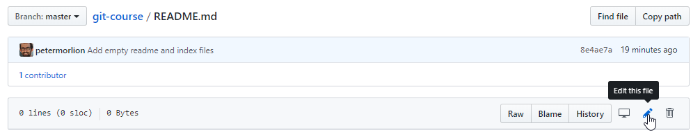
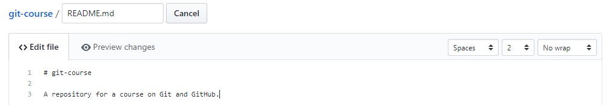
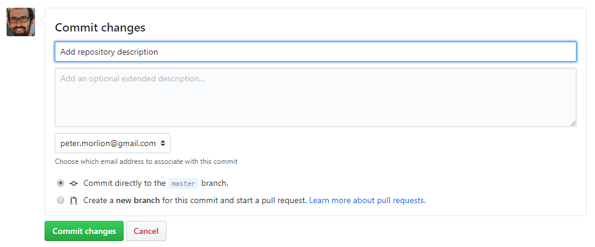
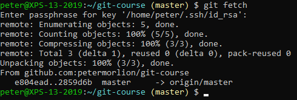
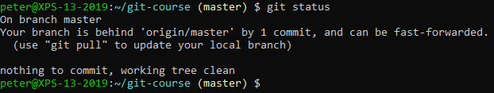
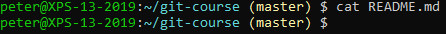

# Fetching from a Remote

Currently, we are in sync with our remote. You can verify by checking the status:

Let's change something in the remote, but not in our local repository. This simulates a change by someone else.
Go to your repository on github.com and click on a file under the "Code" tab:

 
Click on the pencil icon to edit this file online:

 
Edit the file by adding some text:

 
Add a commit message and commit the change:

Now fetch these changes, without merging them into your working directory:

If you check the status now, you will see we're one commit behind:

 
Check the file on your machine to verify the change isn't in your working directory yet:

