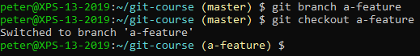

# Creating a Branch

Create and checkout a new branch:

 
Add some commits by changing files, adding and committing them, like we did previously. You should be able to end up with a log like this:

 
Notice how:
- Our remote (origin/master) is currently at an older commit
- The HEAD of our repository (where we are in our repository) is pointing to our new branch
