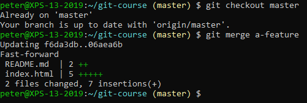
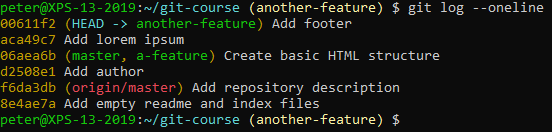
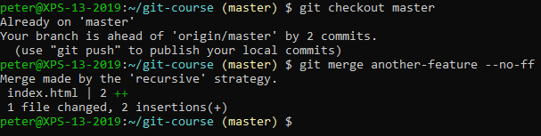
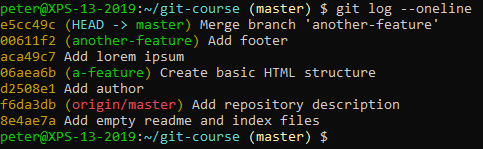
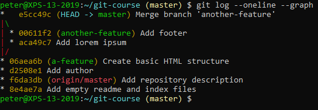

# Merging

## Fast-forward

Merge the branch into the master branch:

## No Fast-forward

Create a new branch with several commits:

 
Now merge without fast-forwarding:

 
An editor will appear for the commit message. In many cases, this is vim. You can leave the default commit message and close vim by typing `:wq`:
- `:` to enter command mode
- `w` to write the contents 
- `q` to quit vim

Check the logs again:

 
You can see the branches more clearly with the graph representation:

 
- The first branch doesn't show because we used a fast-forward merge.
- The second branch has a separate merge commit because we didn't fast-forward. This is also why we can clearly see there was a branch.
