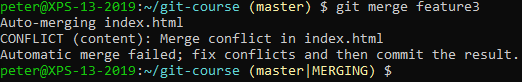
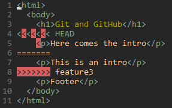
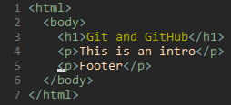
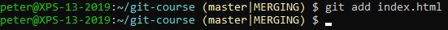
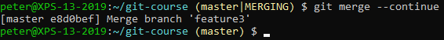
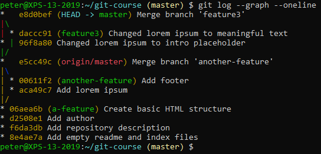

# Merge Conflicts

Create a branch that will lead to a merge conflict:
- `git checkout -b feature3`
- Edit a file
- create a new commit with the edited file
- `git checkout master`
- Edit the same line of the same file, but with a different edit
- create a new commit with the edited file
- `git merge feature3`

This should lead to the following output:

You can see an overview of merged and unmerged files by requesting the status (`git status`). To fix the conflict, open the file in your editor (vim in this example):

Fix the conflict by choosing the correct line and removing the conflict markers (<, = and > characters):

Close your editor (`!wq` for vim).

Add the updated file to the staged changes:

Continue the merge:

Check the log to see the merge:

