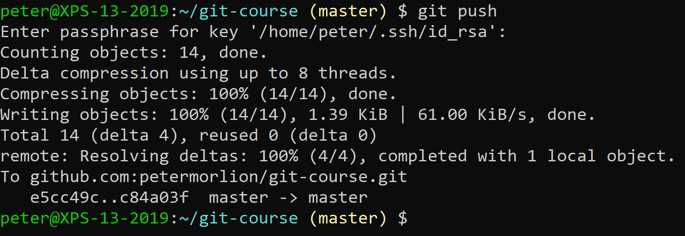
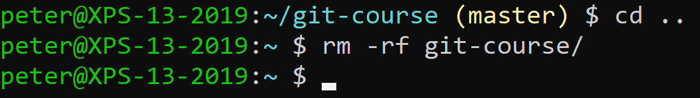
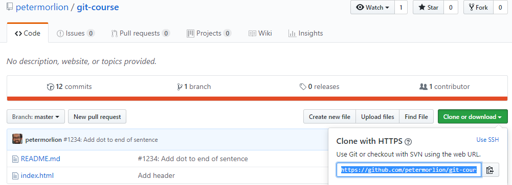
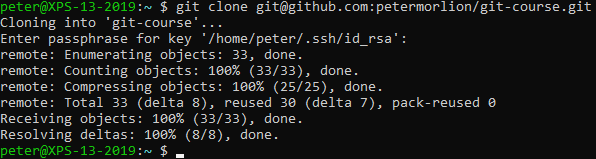

# Cloning

Push your repository to the remote, so that you don't lose any work:

Now move one folder up and remove the folder on your machine:

Verify that the folder is no longer there with `ls`.

Now, clone the repository. You can find the correct URL in GitHub:

To clone the repository, run the `git clone` command with that URL:

Make sure you use your preferred protocol (HTTPS or SSH).
