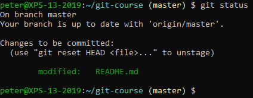
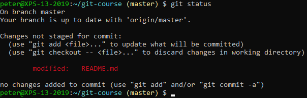
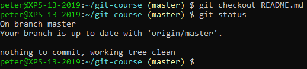
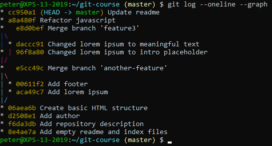
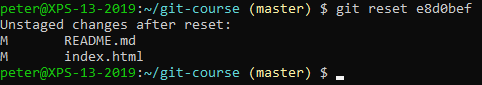
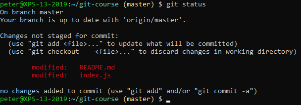

# Git Reset

## Staged Changes

Make change to a file and stage it to be committed:

Check the status:

You can unstage the change by using git reset:

Check the status again:

The file is still modified, but no longer staged. You can undo the changes
by checking it out:

## To Previous Commits

Check the log:

Add some commits and check the log again:

Let's reset back to the commit before our most recent changes (`e8d0bef` in our screenshot):

Check the log to verify that our commits have gone:

But our changes are still available locally:

