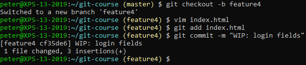
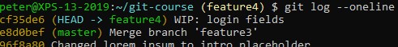
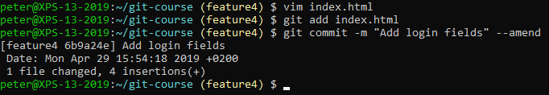
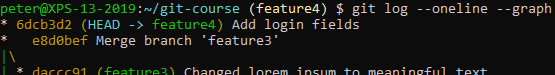

# Amending to Commits

Create a new branch and add a commit:

 
Check the log:

 
Take note of the hash (`cf35de6` in the screenshot above).

Now edit the file again and amend the commit:

 
Check the log again and see how we still have one commit but with a different hash (`6dcb3d2`):

