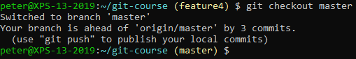
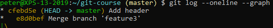
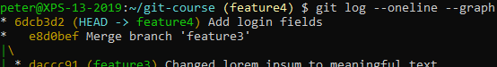
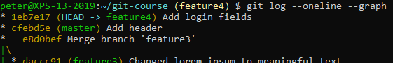

# Rebasing

Leave the feature4 branch intact and switch to the master branch:

 
Create some commits on your master branch. Your log should look like this:

Switch back to your feature4 branch and look at the log:

 
Notice the hash (`6dcb3d2`).

Now rebase onto master:

 
Look at the log again:

 
The feature4 branch is now based off the last commit on master, and the feature4 commit has a new hash (`1eb7e17`).
