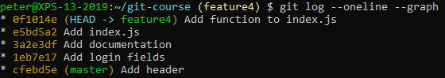
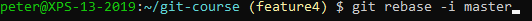
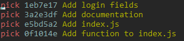
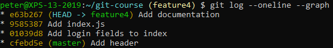

# Interactive Rebasing

Switch to the `feature4` branch and add some more commits so you have a log with several commits on the branch:

 
Now rebase interactively onto master:

 
Your editor will open:

 
Now change it to:

 
We will:
- Reword the first commit
- Move the second commit to the end
- Squash the other two commits into one and keep the first commit message

Check the result in your log:
 

