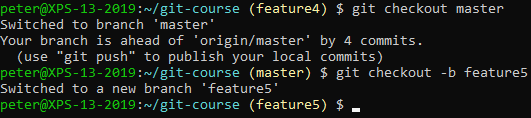
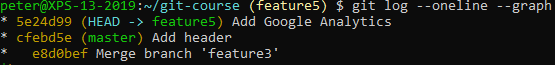
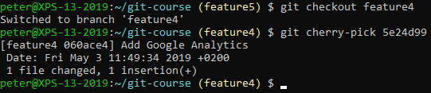
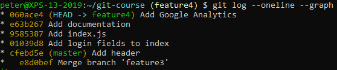

# Cherry-Picking

Check out master, create a new branch and check out the new branch:

Add one or more commits and check the log:

Take note of the commit (`5e24d99`).

Switch to the `feature4` branch and cherry-pick the commit:

 
Check the log:

