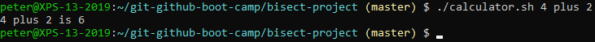
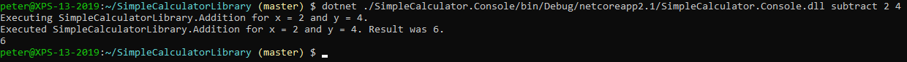
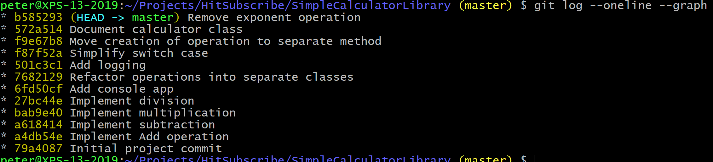
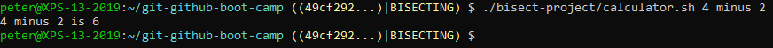
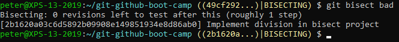
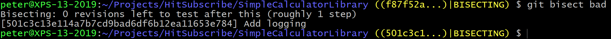
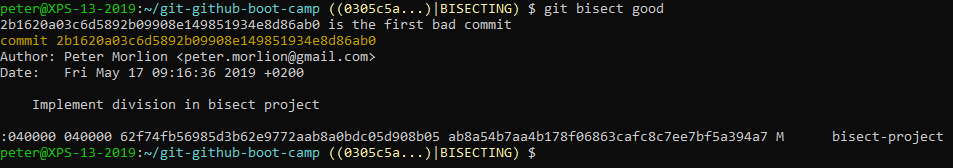
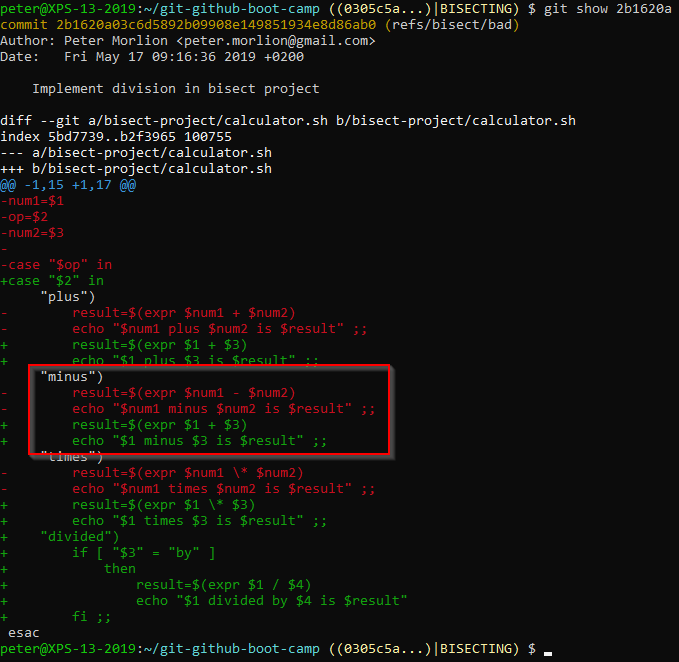
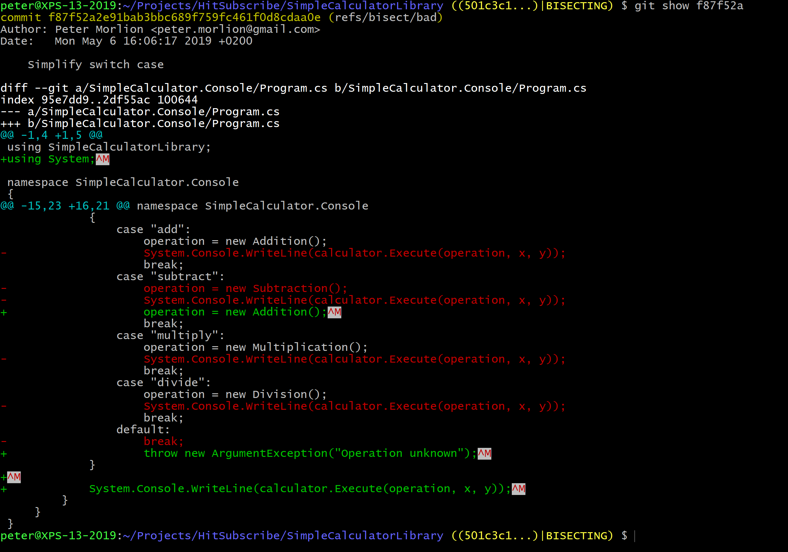

# Manual Bisect

If you haven't yet cloned it, clone this repository by running this command (in a directory that isn't a Git repository):

```
git clone git@github.com:techtown-training/git-github-boot-camp.git
```

Switch to the `bisect-project` folder:

```
cd bisect-project
```

Run an addition to see that it works:



Run a subtraction to see that it doesn't produce the correct result:


 
Look at the log:


 
Let's assume we know the bug wasn't there when the minus operation was first implemented. This means it must have been introduced between commit `f0fc406` and `155e37d`.

Start a bisect and tell Git the last known good commit and the first known bad commit (move to the root of your repository first by running `cd ..`):


 
Now run the subtraction again:


 
The result is still wrong, so tell Git this is a bad commit:


 
Run the subtraction again. If the result is wrong again, do another `git bisect bad` and run the subtraction again. The result should be now correct:


 
So tell Git this is a good commit:


 
You can see the details of the commit by running `git show <commit-id>`:



See how we introduced a bug there?

Exit the bisect session by calling `git bisect reset`:


