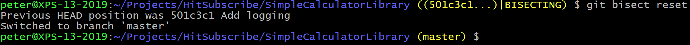

# Manual Bisect

For this section, we'll use a repository that contains some actual code.

Clone the repository:

Build the project:

 
Run an addition to see that it works:

Run a subtraction to see that it doesn't produce the correct result:

 
Look at the log:

 
Let's assume we know the bug wasn't there when console app was implemented. This means it must have been introduced between commit `6fd50cf` and `b585293`.

Start a bisect and tell Git the last known good commit and the first known bad commit:

 
Now build the application and run the subtraction again:

 
The result is still wrong, so tell Git this is a bad commit:

 
Build and run the application again. The result should be correct:

 
So tell Git this is a good commit:

 
You can see the details of the commit by running `git show <commit-id>`:

Exit the bisect session by calling `git bisect reset`:

