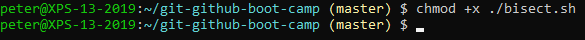
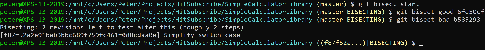
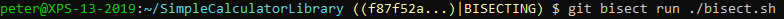
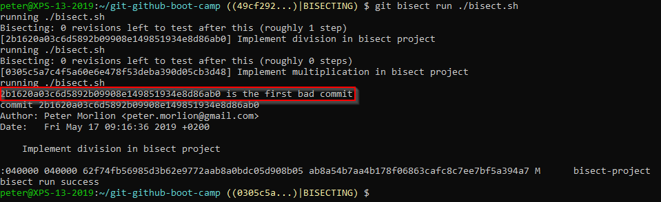
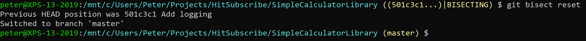

# Automatic Bisect

First, create a script that will return exit code -1 if the result is not correct:

```
dotnet build SimpleCalculatorLibrary.sln

if [ $(dotnet ./SimpleCalculator.Console/bin/Debug/netcoreapp2.1/SimpleCalculator.Console.dll subtract 5 1 | grep -c "Result was 4") -ne 1 ]
then
    exit -1
fi

exit 0
```

Save this file as a bash file (e.g. `bisect.sh`). On Windows, you’ll have to run this in Git Bash.

Be sure to make the script executable (might not be necessary on Windows):



To start the bisect session, tell Git to start a bisect session and what the good and bad commits are:


 
Now, tell Git which command to run:


 
Git will now run the script for several commits. In the end, it will find the commit that introduced the bug:


 
Exit the bisect session:
 

