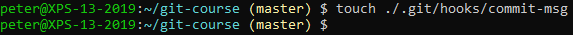
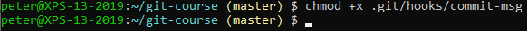
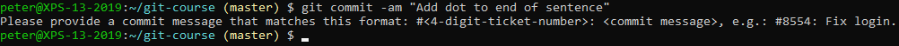
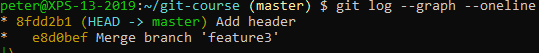
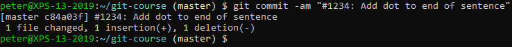
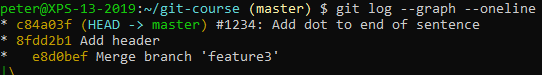
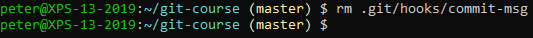

# Hooks

We'll create a commit hook that tells us our commit message should follow a certain pattern.

Create a `commit-msg` file in the `.git/hooks` folder:


 
Put this Bash script in the file:

```
#!/bin/bash

pattern="#[0-9]{4}: .{1,}"

if [[ ! $(cat $1) =~ $pattern ]]
then
  echo Please provide a commit message that matches this format: "#<4-digit-ticket-number>: <commit message>", e.g.: "#8554: Fix login".
  exit 1
fi
```

Be sure to make the script executable (this might not be necessary on Windows):



Edit a file and then try to commit it with the wrong commit message format:


 
Verify that the commit hasn't occurred:


 
Now try to commit with a correctly formatted message:


 
The change will now be committed:



Remove the `commit-msg` file:


