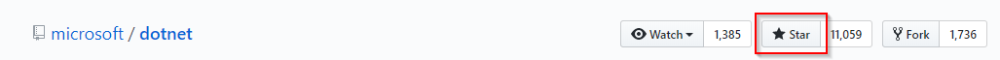
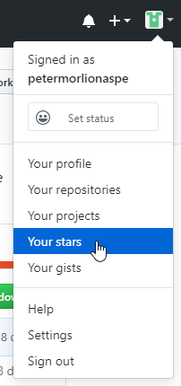
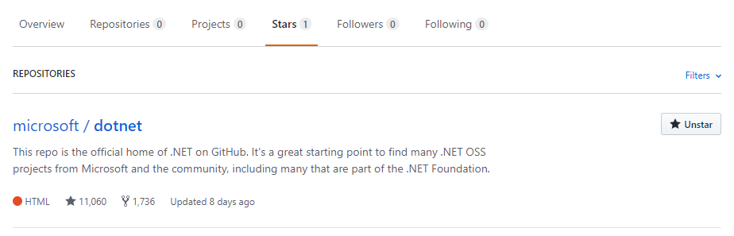

# Starring Repositories

Find a repository you find interesting and click the Star button:

Find your starred repositories in the user menu:

You should see an overview of all repositories you have given a star:

