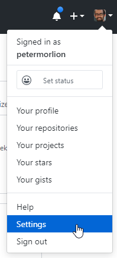
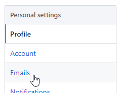
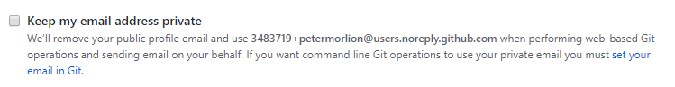
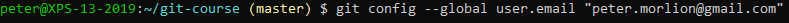

# Commit Email Addresses

To hide your personal email address, go to Settings:

Choose Emails:

Enable the option to keep your email address private and copy the email address:

Now, configure Git to use this or your personal email address:

