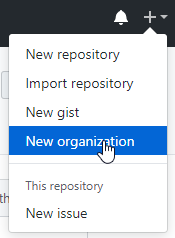
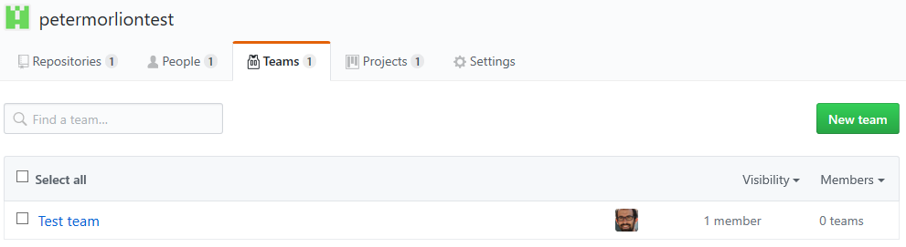
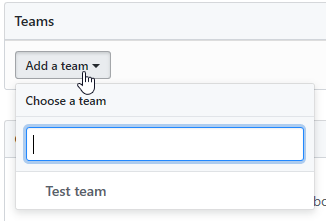
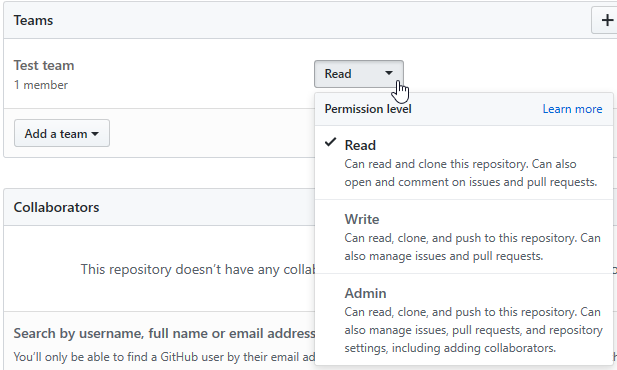

# Organizations Accounts

Create a new organization:

Follow the steps to
- create the organization
- invite members
- set the organization details

When you create a new repository, you can now set the organization as the owner:

Go to the organizations account page and create a new team under the "Teams" tab:

Fill out the details and you should see the team:

When you go to the repository of the organization, under the "Settings" tab, choose the "Collaborators & teams" sections:

Here you can add teams and individual collaborators.

To add a team select it from the dropdown:

After choosing a team, you will be able to select the permission level for this team:

