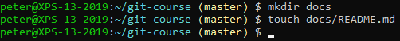
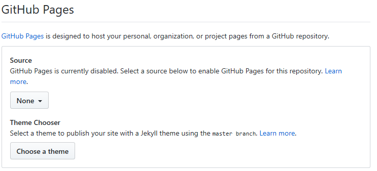
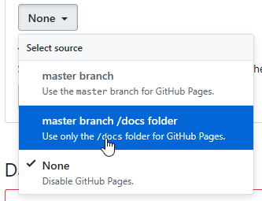
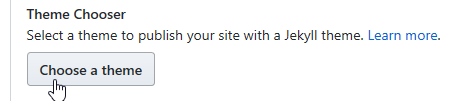
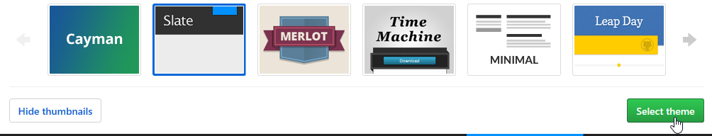
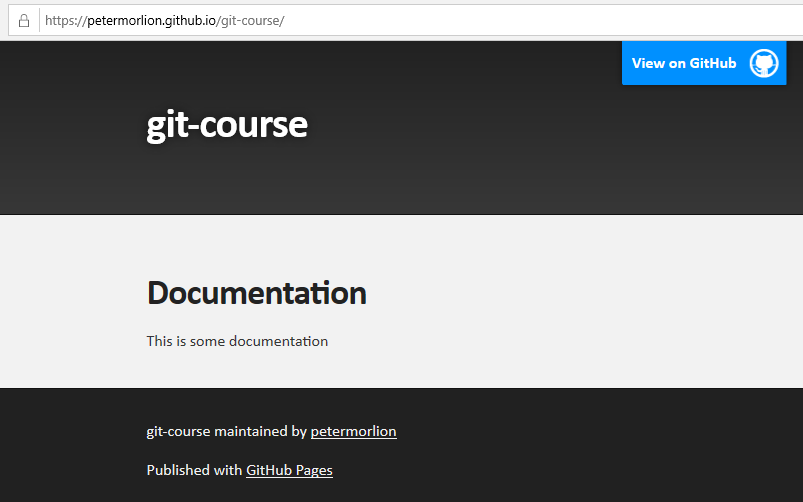

# GitHub Pages

First, create a `docs/` folder and add a new Markdown file:

Edit the file and push this to the remote.

Go to the Settings tab of your repository:

Scroll down to the "GitHub Pages" section:

Select the source:

(You could use the master branch too, but that would render our index.html file instead of our markdown file).

After the page reloads, click the button to choose a theme:

Choose a theme and click the green "Select theme" button:

Now point your browser to https://_username_.github.io/_repository_:

