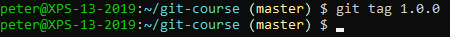
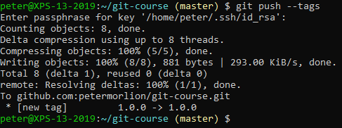
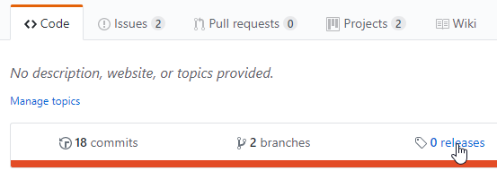
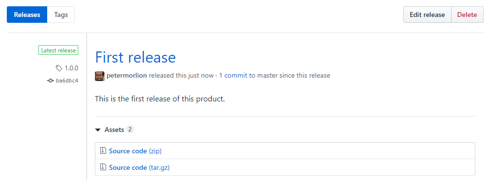

# Releases

First, tag a commit in the repository:

Push the tag(s) to the remote:

Go to the releases page in GitHub:

Create a release in the "Tags" section:

Fill out the details and click "Publish release". This is the result:

